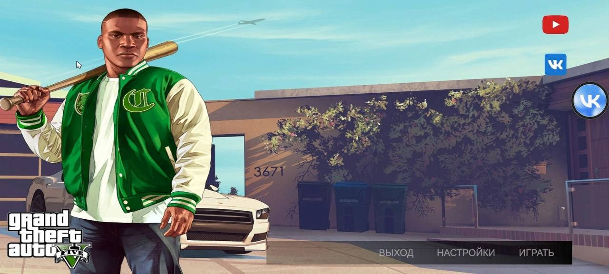
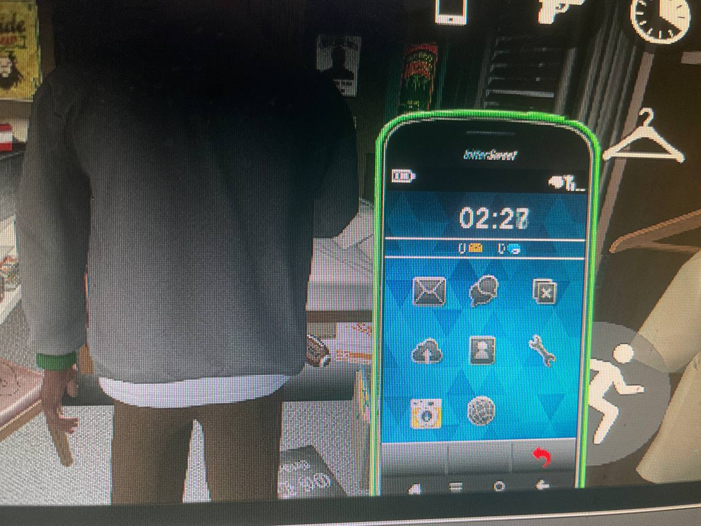
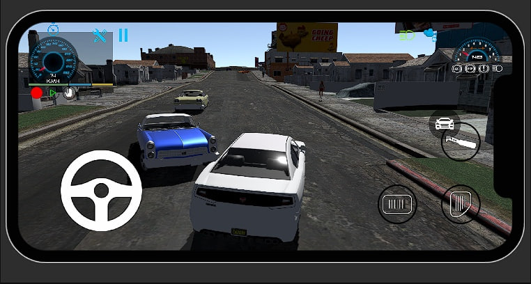
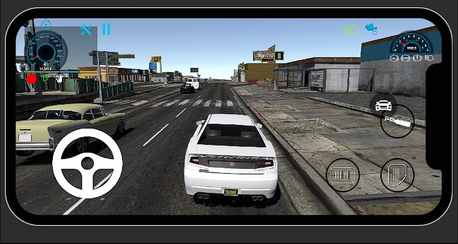
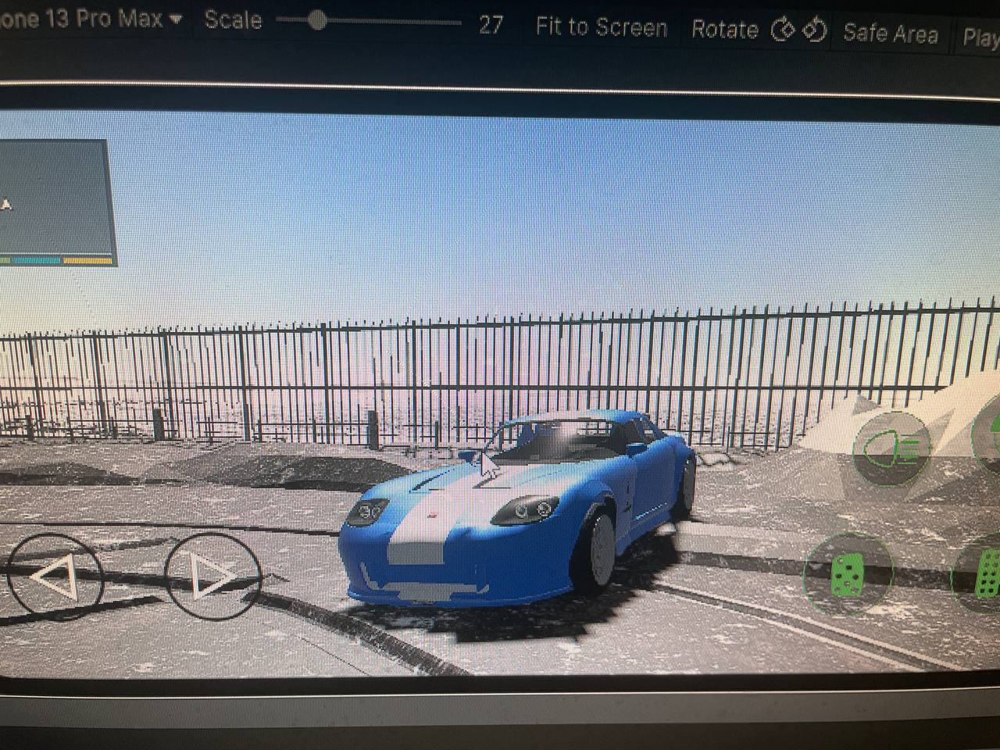

# GTA 5 Mobile (Fan Project, Canceled)

### 📱 Полноценный перенос GTA 5 на мобильные устройства (Unity, URP)

> **Статус:** завершён, отменён из-за высокой требовательности к устройствам

---

## 📌 Описание

Фанатская 3D-игра, воссоздающая GTA 5 для мобильных устройств.  
Разработка велась **одним человеком** — от карты до всех систем.

### 🧩 Особенности:
- Полная карта **Лос-Сантоса** и **Северного Янктона**
- Все **автомобили из GTA 5** со спавном через меню
- **NPC** с ИИ, трафик, прохожие
- **Интерьеры**, растительность, освещение, анимации
- Полнофункциональный **телефон в игре**
- Система **гардероба**: переодевание от обуви до рюкзака

---

## 🔧 Технологии

- Unity + URP
- C#
- Shader Graph
- Mobile Optimization
- Addressables

---

## 🧑‍💻 Моя роль

- **Вся разработка** (дизайн, код, сцены, UI, логика)
- Оптимизация под мобильные платформы
- Реализация всех внутриигровых систем

---

## 📸 Скриншоты

---

## 🎥 Видео (бета)

➡️ 

---

## ⚠️ Примечание

Проект не является коммерческим и не связан с Rockstar Games. Все ресурсы использовались исключительно в образовательных целях.
